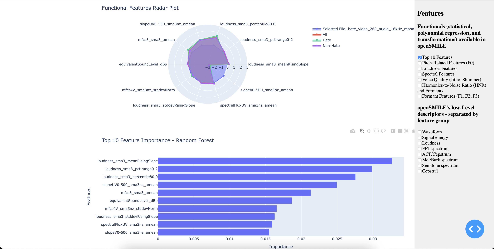

# Welcome to My Data Science Portfolio

## About Me

I'm a data scientist with expertise in Python, machine learning, and speech recognition. Currently working on projects related to hate speech detection and audio analysis.

## Projects

### Hate Speech Detection from Audio (Work in Progress)

- Tools: Python, OpenSmile, Whisper, TensorFlow
- Description: Developing a system to detect hate speech in audio using machine learning models and speech feature extraction. The project includes a graphical user interface (GUI) for ease of use.
<!-- - [View Code](https://github.com/pfs-db/hate-speech-project) -->
- **Current Progress:**
  - Organized folder structure.
  - Initial GUI developed.

### Data Visualization of Wildfires (Group Project)

- Tools: Python, Plotly, GeoPandas
- Description: Collaborated in a group project focused on visualizing wildfire data, using data science techniques to analyze geographical and temporal patterns.
- [View Code](https://github.com/pfs-db/dataviz-wildfire)

### Haskell Project

- Tools: Haskell
- Description: Project developed for understanding functional programming concepts.
- [View Code](https://github.com/pfs-db/pi3-ws23-ueb-pablo)

## Areas of Interesse

### Computational Processing of Nheengatú (Modern Tupí)

- Tools: Python
- Description: Tools and resources for the computational processing of Nheengatú, a Tupi-Guarani language.
- [View Code](https://github.com/pfs-db/nheengatu)

### Rust Exploration

- Tools: Rust
- Description: A personal project to explore and learn Rust, with examples and learning resources.
- [View Code](https://github.com/pfs-db/rust2learn)

## Skills

- Python, TensorFlow, scikit-learn
- Speech Processing: OpenSmile, Whisper
- Data Visualization: Matplotlib, Plotly, Dash
- Database: SQL, NoSQL

## Contact Me

- Email: pablo2@uni-bremen.de
- LinkedIn: [pablo-freitas-it](https://linkedin.com/in/pablo-freitas-it)
- GitHub: [pfs-db](https://github.com/pfs-db)
